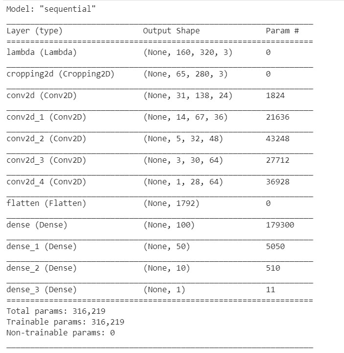
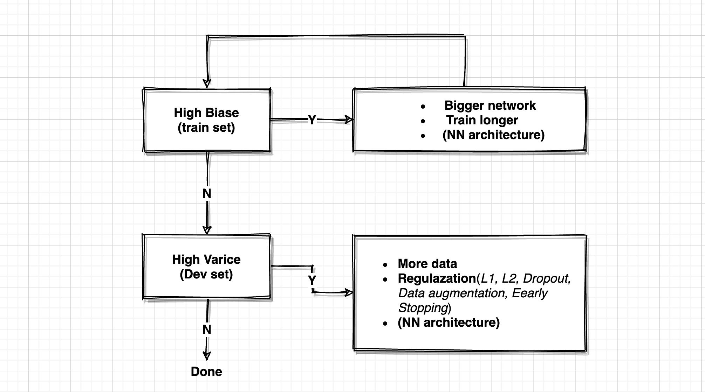
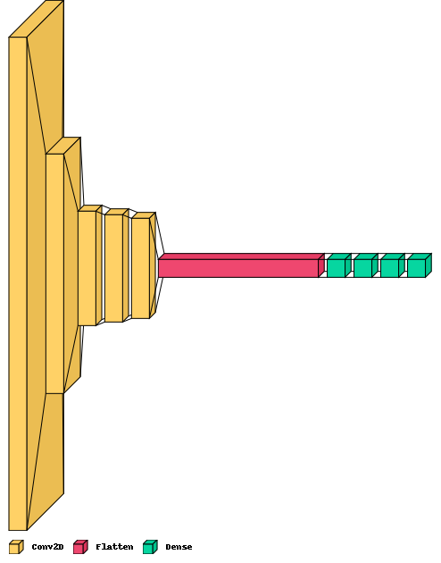
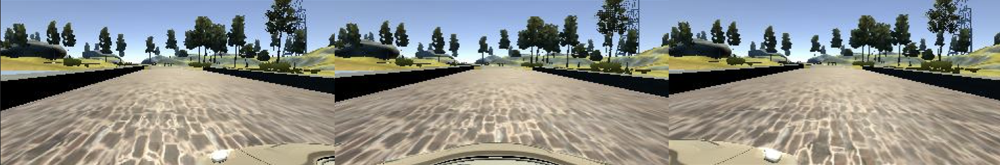

# **Behavioral Cloning** 

The goals / steps of this project are the following:
* Use the simulator to collect data of good driving behavior
* Build, a convolution neural network in Keras that predicts steering angles from images
* Train and validate the model with a training and validation set
* Test that the model successfully drives around track one without leaving the road
* Summarize the results with a written report

---
### Files Submitted & Code Quality

#### 1. Submission includes all required files and can be used to run the simulator in autonomous mode

My project includes the following files:
* model.py containing the script to create and train the model
* drive.py for driving the car in autonomous mode
* model.h5 containing a trained convolution neural network 
* video.mp4 recording test video 
* report.md summarizing the results

#### 2. Submission includes functional code
Using the Udacity provided simulator and my drive.py file, the car can be driven autonomously around the track by executing 
```sh
python drive.py model.h5
```

#### 3. Submission code is usable and readable

The model.py file contains the code for training and saving the convolution neural network. The file shows the pipeline I used for training and validating the model, and it contains comments to explain how the code works.

### Model Architecture and Training Strategy

#### 1. An appropriate model architecture has been employed

My model design reference Nvidia arXiv:1604.07316v1 End to End Learning for Self-Driving Cars. 

My model consists of 3 convolution neural network with 5x5 filter sizes and 2 convolution neural network with 3x3 filter sizes, 3 Dense layers as following. (model.py lines 47-60) 

The model includes RELU layers to introduce nonlinearity, and the data is normalized in the model using a Keras lambda layer (code line 48). 



#### 2. Attempts to reduce overfitting in the model

The model contains regularizers **l2**  and **EarlyStopping** in order to reduce overfitting. 
```
layers.Dense(100, activation='relu', kernel_regularizer='l2'),  
layers.Dense(50, activation='relu', kernel_regularizer='l2'),
```
```
callbacks = [
    EarlyStopping(monitor='val_loss', patience=4),
    ModelCheckpoint('model.h5', monitor='val_loss', verbose=1, save_best_only=True, mode='auto')
]
```


The model was trained and validated on different data sets to ensure that the model was not overfitting. The model was tested by running it through the simulator and ensuring that the vehicle could stay on the track.

```
history = model.fit_generator(train_generator, steps_per_epoch=STEP_SIZE_TRAIN, 
                              validation_data=valid_generator, validation_steps=STEP_SIZE_VALID,
                              epochs=EPOCHS, verbose=1, callbacks=callbacks)
```

#### 3. Model parameter tuning

The model used an adam optimizer, so the learning rate was not tuned manually.
```
model.compile(loss='mse', optimizer='Adam') 
```

#### 4. Appropriate training data

Training data was chosen to keep the vehicle driving on the road. I used a combination of center lane driving, recovering from the left and right sides of the road .


### Model Architecture and Training Strategy

#### 1. Solution Design Approach

The overall strategy for deriving a model architecture was to 



I found that there was enough data to train model well . But The train loss was exploding at some point. So I added EarlyStopping and L2 in Dense layers. But The vehicle always run off the road in a certain place. I found the key is crop images as following:
```
layers.Cropping2D(cropping=((70,25), (20,20)), input_shape=(160, 320, 3)),
```
At the end of the process, the vehicle is able to drive autonomously around the track without leaving the road.

#### 2. Final Model Architecture

The final model architecture :
```
    model = Sequential([
    layers.Lambda(lambda x: (x / 255.0) - 0.5, input_shape=(160, 320, 3)),
    layers.Cropping2D(cropping=((70,25), (20,20)), input_shape=(160, 320, 3)),
    layers.Conv2D(24, kernel_size=(5, 5), subsample =(2, 2), activation='relu'),
    layers.Conv2D(36, kernel_size=(5, 5), subsample =(2, 2), activation='relu'),
    layers.Conv2D(48, kernel_size=(5, 5), subsample =(2, 2), activation='relu'),   
    layers.Conv2D(64, kernel_size=(3, 3), activation='relu'),
    layers.Conv2D(64, kernel_size=(3, 3), activation='relu'),
    layers.Flatten(),
    layers.Dense(100, activation='relu', kernel_regularizer='l2'),  
    layers.Dense(50, activation='relu', kernel_regularizer='l2'),
    layers.Dense(10, activation='relu')
    layers.Dense(1)
])

```


Here is a visualization of the architecture:




#### 3. Creation of the Training Set & Training Process


To augment the data sat, I used left\center\right cameras and setted CORRECTION config as '0.2'

```
new_df['features'] = pd.concat([df['center'], df['left'], df['right']], ignore_index=True)
new_df['labels']  = pd.concat([df['steering'], df['steering']+CORRECTION, df['steering']-CORRECTION], ignore_index=True)
```





I used this training data for training the model. The validation set helped determine if the model was over or under fitting. The ideal number of epochs was 15  as evidenced by val 0.007 I used an adam optimizer so that manually training the learning rate wasn't necessary.

```
callbacks = [
  EarlyStopping(monitor='val_loss', patience=4),
  ModelCheckpoint('model.h5', monitor='val_loss', verbose=1, save_best_only=True, mode='auto')
]
model.compile(loss='mse', optimizer='Adam') 

history = model.fit_generator(train_generator, steps_per_epoch=STEP_SIZE_TRAIN, 
                            validation_data=valid_generator, validation_steps=STEP_SIZE_VALID,
                            epochs=EPOCHS, verbose=1, callbacks=callbacks)
```

References

[Nvidia: End to End Learning for Self-Driving Cars ](https://images.nvidia.com/content/tegra/automotive/images/2016/solutions/pdf/end-to-end-dl-using-px.pdf)